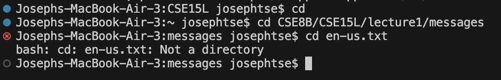
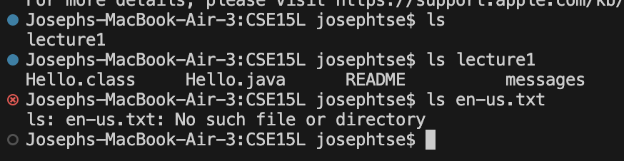
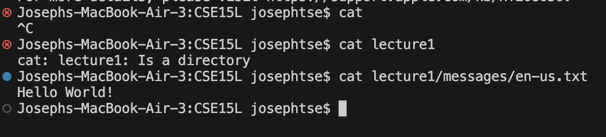

# Lab Report 1
## Remote Access and FileSystem (Week 1)
---

**Assignment**

For **each** of the commands `cd`, `ls`, and `cat`, and using the workspace you created in this lab:
  1. Share an example of using the command with *no* arguments.
  2. Share an example of using the command with a path to a *directory* as an argument.
  3. Share an example of using the command with a path to a *file* as an argument.

Include:
- A screenshot showing the command and its output
- What the **absolute path** to the working directory was right before the command was run
- A sentence or two explaining why you got that output (e.g. what was in the filesystem, what it meant to have no arguments).
- Indicate explicitly whether the output is an *error* or not, and if it's an error, explain why it's an error in one or two sentences.

---

## Screenshot

## Absolute Path

`/Users/josephtse/CSE8B/CSE15L`
`/Users/josephtse`
`/Users/josephtse/CSE8B/CSE15L/lecture1/messages`

## Explanation

`cd`

I got this output because when you have no arguments accompanying the cd command in the terminal, what it does is move you to the home directory, 
or going back to the parent directory.

This output is not an error.

`cd CSE8B/CSE15L/Lecturel/messages`

I got this output because `cd` is used to change directories, so if I want to go to the messages folder, then I would have to mention every parent folder 
leading up to that folder, and since I initially used `cd` with no arguments, I had to make my way back.

This output is not an error.

`cd en-us.txt`

I got this output even though I am in the parent directory because you cannot change directories to a file. Even though a file can contain contents, 
that does not mean that there is more to look into, such as another folder.

This output is an error because you cannot change directories to a file, as it is incapable of containing directories.

---

## Screenshot

## Absolute Path

`/Users/josephtse/CSE8B/CSE15L`

## Explanation

`ls`

I got this output because my current directory is the folder `CSE15L`, and the only thing inside that folder is `lecture1`, so the only output was lecture1.

This output is not an error.

`ls lecture1`

I got this output because the argument I put in was asking for a list of items within the directory lecture1, which would then print out the items within 
lecture1, not the current directory.

This output is not an error.

`ls en-us.txt`

I got this output because as the file holds nothing that the computer can read at the moment in terms of directory, there is nothing to list out.

This output is an error because it is a txt file, and since a txt file cannot hold more items other than the actual contents of the file, there is nothing 
to list out.

---

## Screenshot

## Absolute Path

`/Users/josephtse/CSE8B/CSE15L`

## Explanation

`cat`

I got this output because without any arguments, `cat` cannot run properly.

Although this is not an error, `cat` will infinitely run until forcibly shut down using `ctrl + c`

`cat lecture1`

I got this output because the command `cat` cannot take directories as an argument.

This output is an error because to use `cat` is to concatenate, or to add elements together. This means you cannot add directories together as their 
contents are ones that are unable to be added to something else, usually because they contain more directories and/or files.

`cat lecturel/messages/en-us.txt`

I got this output because there was only one argument, so it only printed the contents of the one argument, as well as being the file itself so it 
can read the contents of the file.

This output is not an error.

---

*End*
