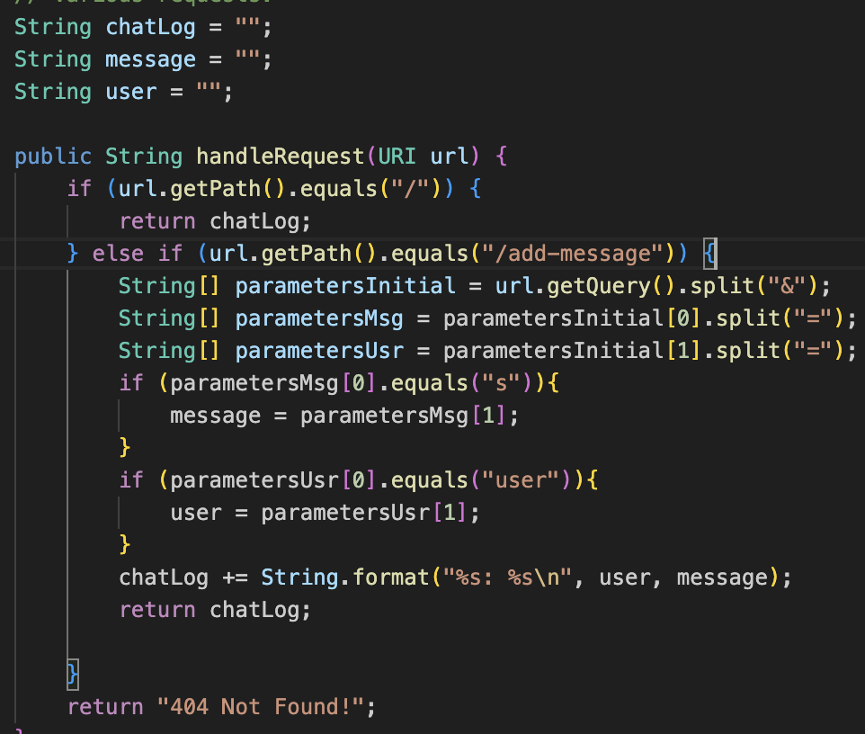
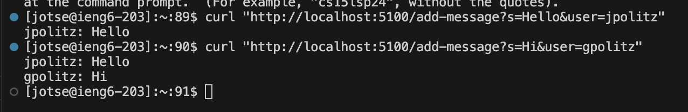
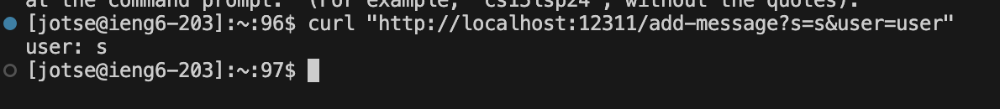
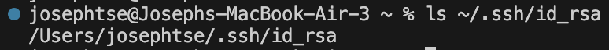
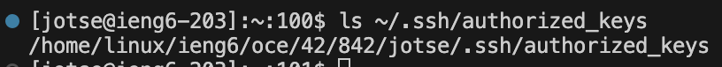
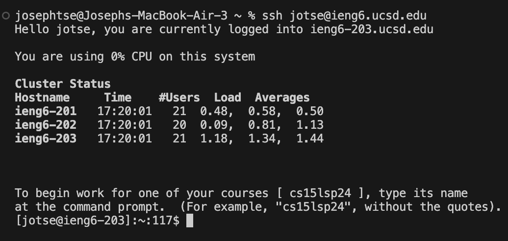

# Lab Report 2

### April 24, 2024
---

## Part 1
### General Task:
Write a web server called `ChatServer` that supports the path and behavior described below. It should keep track of a single string that gets added to by incoming requests. The requests should look like this:
`/add-message?s=<string>&user=<string>`

---

### My Code:

Screenshot 1/2 of using `/add-message`

- The method that was called in this example would be the ChatHandler.
- The relevant arguments to this method would be the entire url of the local website
- All three of the `chatLog`, `message`, and `user` are considered relevant
- The values of these fields change based on the query. The `message` value changes based on the value of s in the query, and `user` is based off of user in the query. `chatLog`, on the other hand, changes based off of the entire query, updating every time a new query has been entered, taking the log of the messages and the user that sent them.
- Other values that are not considered instance variables, but are still relevant, include the `parametersInitial`, which split the query by the "&", `parametersMsg`, which split the first half of `parametersInitial` by "=" to get the message sent, and `parametersUsr`, which does the same thing as `parametersMsg`, but on the second half of `parametersInitial`.

Screenshot 2/2 of using `/add-message`

- Similar to the first example, the only method in this example would be the ChatHandler.
- The relevant arguments would be the entire url of the local website, and the relevant fields would be `chatLog`, `message`, and `user` for the same reasons as mentioned above. The same goes iwht `parametersInitial`, `parametersUsr`, and `parametersMsg`.

---

## Part 2

### General Task: 
Include a screenshot for each of the following

1. Location: **Your Computer**; Task: run `ls` with the **absolute path** to the *private key* for your SSH key for logging into `ieng6`

   

2. Location: **ieng6 machine**; Task: run `ls` with the **absolute path** to the *public* key for your SSH key for logging into `ieng6`

   

3. Location: **Your Computer**; Task: Log into your `ieng6` account *without* being asked for a password.

   

---

## Part 3

### General Task:
In 2-3 sentences, describe something you learned from lab in week 2 or 3 that you didn't know before.

One thing I learned from lab that I didn't know before is the ssh command. I didn't understand before what it did or what it was used for, but now I can see that it is very useful for connecting to remote servers to perform work from a remote location, which can help when you need to collaborate with someone else for work, or you aren't on a work computer.

