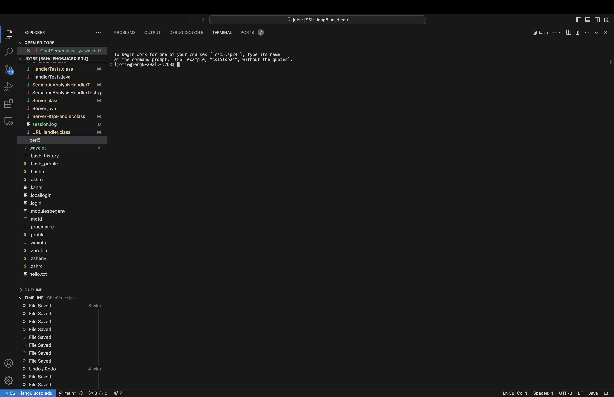
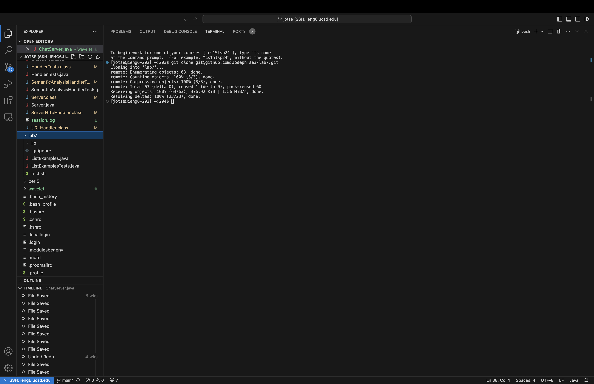
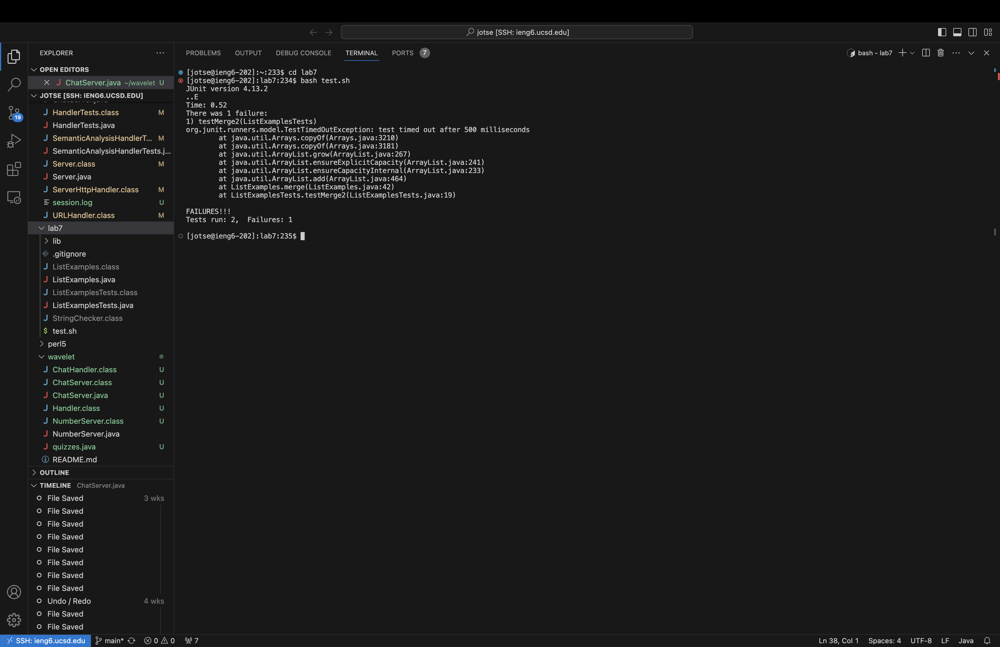
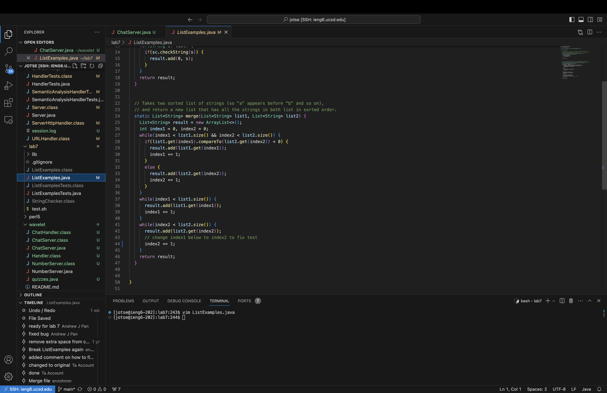
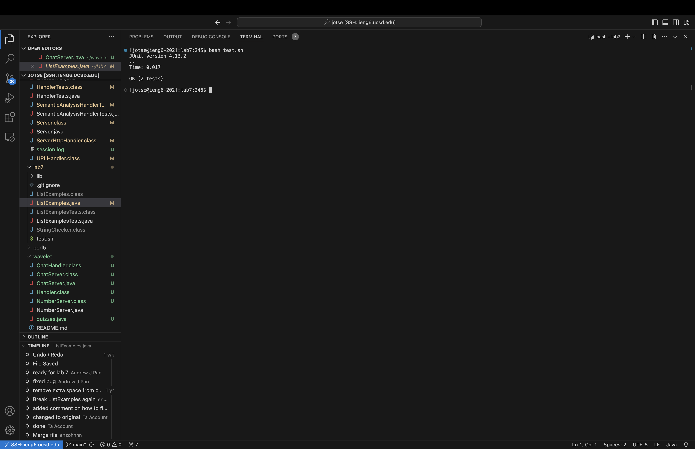
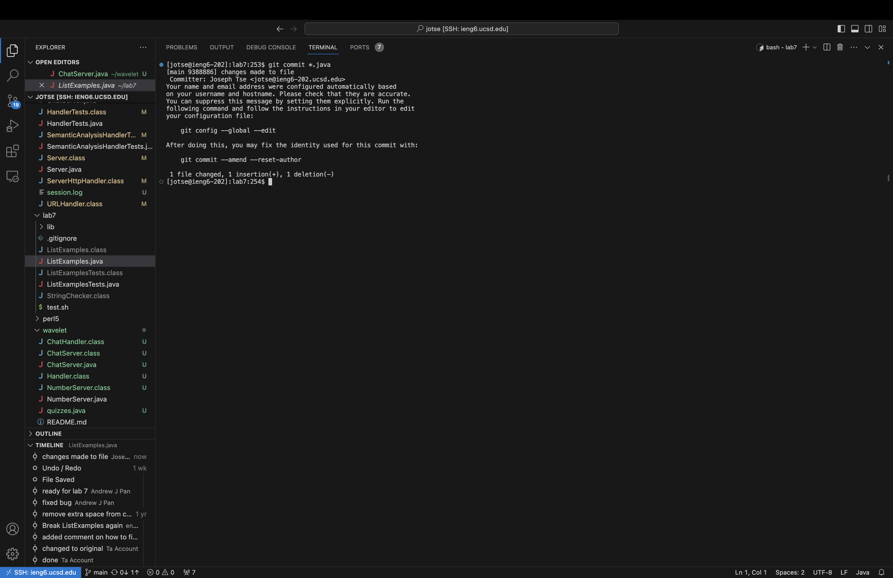
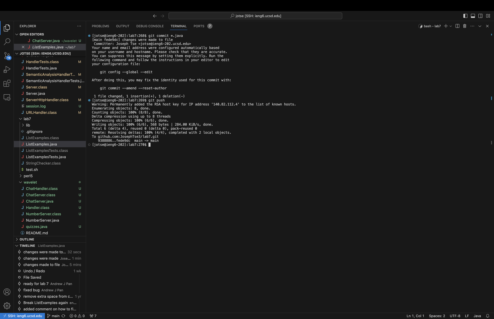

# Lab Report 4

## Instructions

For **each** numbered step starting right after the timer (so steps 4-9),

  1. Take a screenshot
  2. Write down **exactly** which keys you pressed to get to that step, including `<enter` and `<space>`
  3. Then, summarize the commands you ran and what the effect of those keypresses were.

---

Steps 4-9:

4. Log into ieng6
5. Clone your fork of the repository from your Github account (using the `SSH` URL)
6. Run the tests, demonstrating that they fail
7. Edit the code file to fix the failing test
8. Run the tests, demonstrating that they now succeed
9. Commit and push the resulting change to your Github account

---

## Step 4: Log into ieng6

### Keylog:
`<LMB>`, `<LMB>`, `<LMB>`, `<LMB>`
All I did was connect to ieng6 servers, and then opened up all the files I had stored using 4 clicks.

---

## Step 5: Clone your fork of the repository from your Github account using `SSH` url.

### Keylog:
`<LMB>`, `<LMB>`, `<LMB>` (Three clicks to copy SSH url), 
`<LMB>`, `git<space>clone<space>`, `<CMD + V>`, `<enter>` (Enter terminal, cloned fork of repo, entered)

---

## Step 6: Run the tests, demonstrating that they fail

### Keylog:
"cd lab7", `<enter>` (Enter `lab7` directory),
`bash<space>test.sh`, `<enter>` (Run the bash file that holds the compiler and the test line for the terminal)

---

## Step 7: Edit the code file to fix the failing tests

### Keylog:
`vim<space>ListExamples.java`, `<enter>` (Use vim editor to enter the test file),
`<LMB>`, `i`, `<backspace>`, `2`, `<esc>` (Edits the index1 to become index2 by just entering location, entering insert mode, exit after changes)
`:wq`, `<enter>` (saves the file and exit back to terminal)

---

## Step 8: Run the tests, demonstrating that they now succeed

### Keylog:
`bash<space>test.sh`, `<enter>` (Compile and run the tests again via bash file)

---

## Step 9: Commit and push the resulting change to your Github account

### Keylog:
`git<space>commit<space>*.java`, `<enter>` (Commit changes to git repo)
`changes<space>made<space>to<space>file`, `<esc>`, `:wq`, `<enter>` (commit message in vim editor)
`git<space>push`, `<enter>` (pushed changes to git repo)

