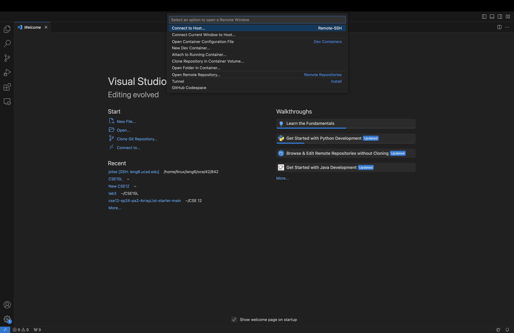
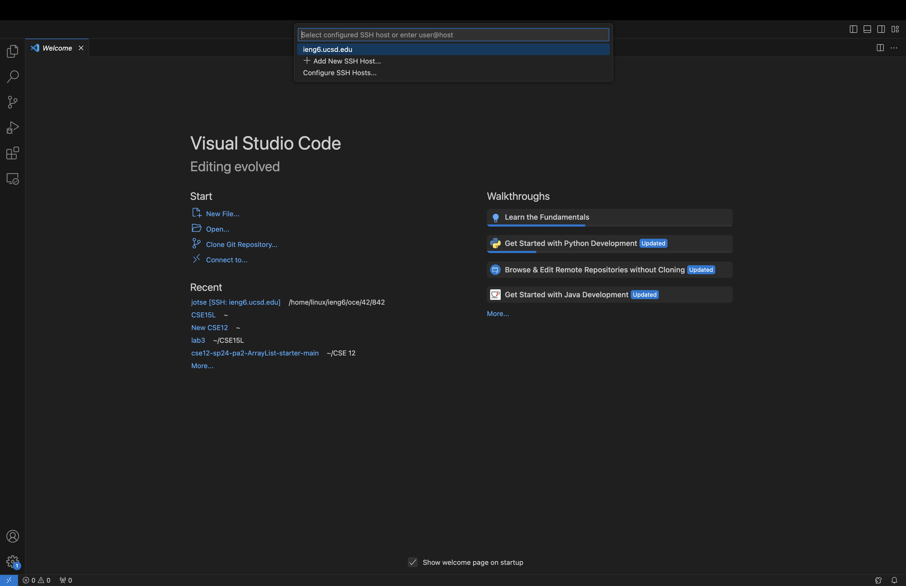
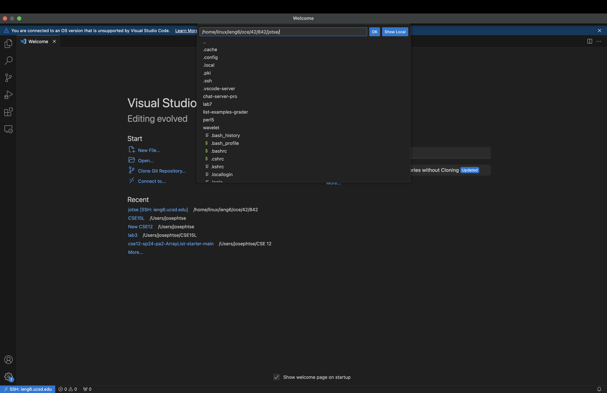
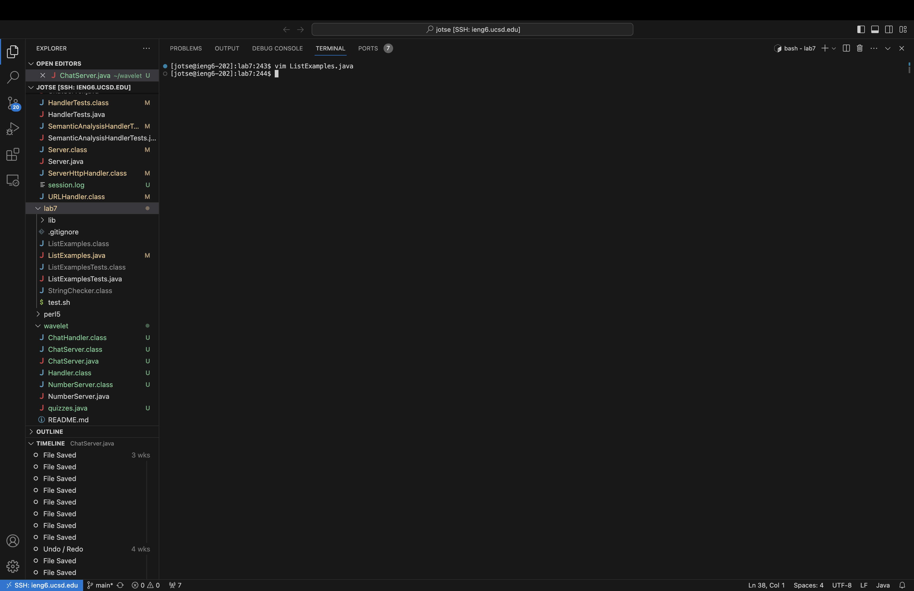
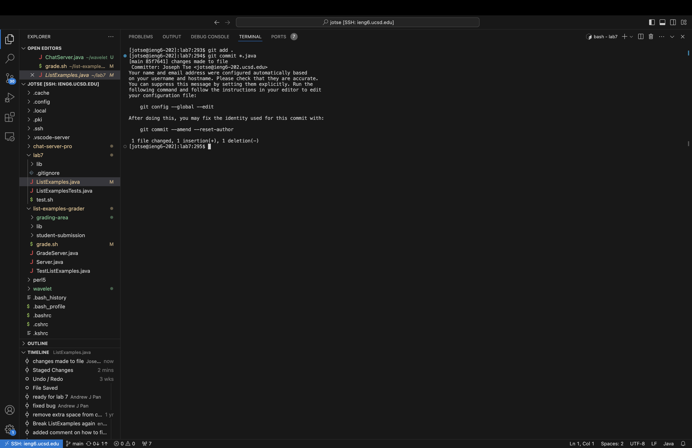

# Lab Report 4

## Instructions

For **each** numbered step starting right after the timer (so steps 4-9),

  1. Take a screenshot
  2. Write down **exactly** which keys you pressed to get to that step, including `<enter` and `<space>`
  3. Then, summarize the commands you ran and what the effect of those keypresses were.

---

Steps 4-9:

4. Log into ieng6
5. Clone your fork of the repository from your Github account (using the `SSH` URL)
6. Run the tests, demonstrating that they fail
7. Edit the code file to fix the failing test
8. Run the tests, demonstrating that they now succeed
9. Commit and push the resulting change to your Github account

---

## Step 4: Log into ieng6

### Keylog:
`<LMB>`, `<LMB>`, `<LMB>`, `<LMB>`, `<LMB>`
All I did was connect to ieng6 servers, and then opened up all the different files I had stored using 4 clicks. 
- The files I had stored were all from previous labs.
- The first 3 clicks were shown in the top 2 images shown above, where they were used to connect to the ieng6 servers by clicking on the bottom left blue icon, then clicking on Connect to Host then ieng6 server in the submenu that popped up
- The fourth click was used to press "Open" in order to show a menu that allows me to open up all of my files that are within the ieng6 servers under my user, all collected from previous labs.
- The fifth click was just to click "Ok" in order to actually open the files previously mentioned in the explorer.

---

## Step 5: Clone your fork of the repository from your Github account using `SSH` url.

### Keylog:
`<LMB>`, `<LMB>`, `<LMB>` (Three clicks to copy SSH url), 
`<LMB>`, `git<space>clone<space>`, `<CMD + V>`, `<enter>` (Enter terminal, cloned fork of repo, entered)
`clear`, `<enter>` (clear terminal)

---

## Step 6: Run the tests, demonstrating that they fail

### Keylog:
`cd<space>lab7`, `<enter>` (Enter `lab7` directory),
`bash<space>test.sh`, `<enter>` (Run the bash file that holds the compiler and the test line for the terminal)
`clear`, `<enter>` (clear terminal)

---

## Step 7: Edit the code file to fix the failing tests

### Keylog:
`vim<space>ListExamples.java`, `<enter>` (Use vim editor to enter the test file),
`<LMB>`, `i`, `<backspace>`, `2`, `<esc>` (Edits the index1 to become index2 by just entering location, entering insert mode, exit after changes)
`:wq`, `<enter>` (saves the file and exit back to terminal)
`clear`, `<enter>` (clear terminal)

---

## Step 8: Run the tests, demonstrating that they now succeed

### Keylog:
`bash<space>test.sh`, `<enter>` (Compile and run the tests again via bash file)
`clear`, `<enter>` (clear terminal)

---

## Step 9: Commit and push the resulting change to your Github account

### Keylog:
`git<space>add<space>.`, `<enter>` (Add all file changes to the git repo)
`git<space>commit<space>*.java`, `<enter>` (Commit changes to git repo)
`changes<space>made<space>to<space>file`, `<esc>`, `:wq`, `<enter>` (commit message in vim editor)
`git<space>push`, `<enter>` (pushed changes to git repo)

