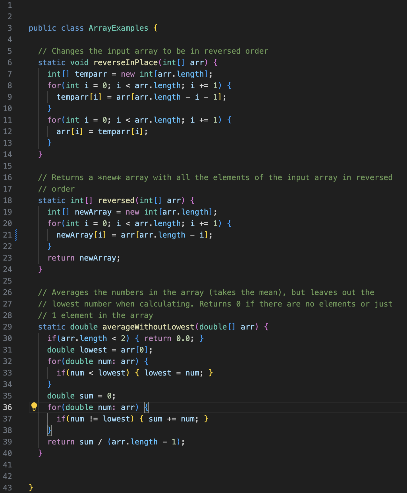
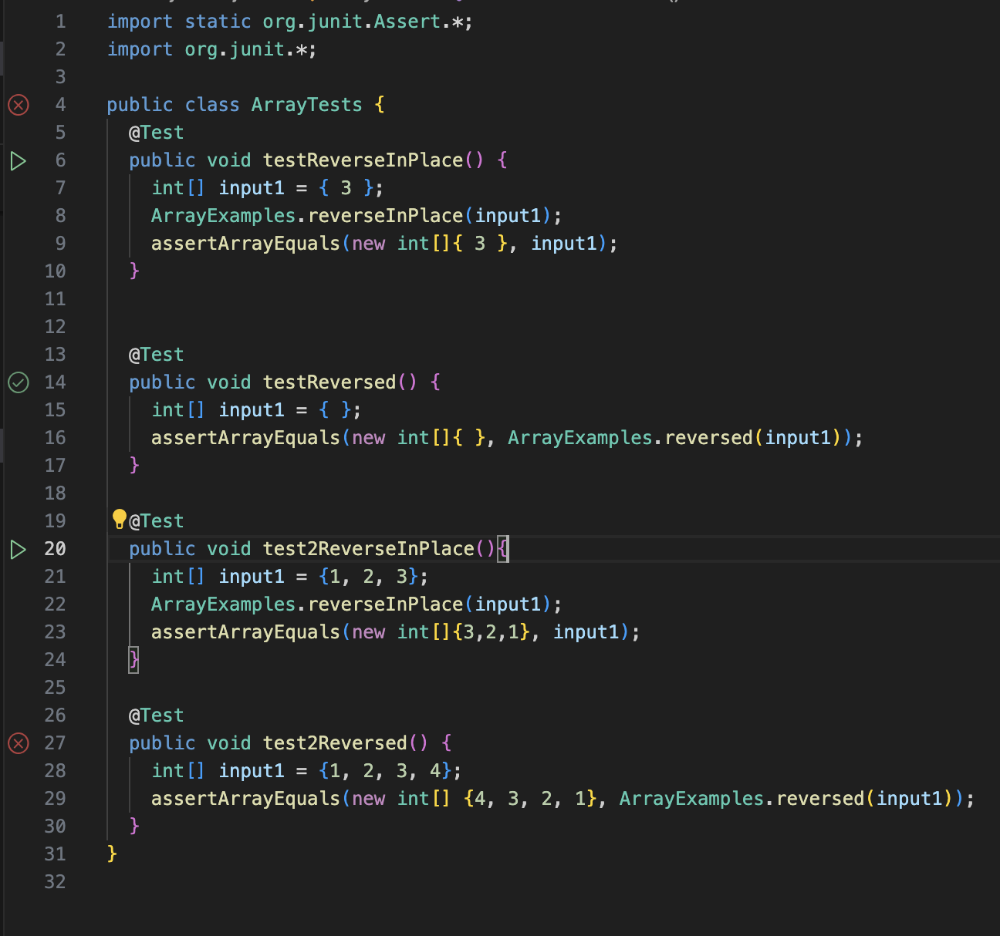
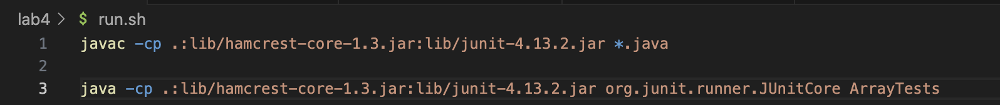
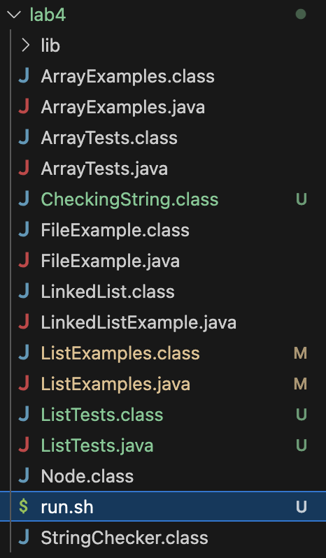

# Lab Report 5
---

## Instructions:
- Design a debugging scenario, and write your repott as a conversation on Piazza
- It should involve at least a Java file and a bash script.

## Part 1 - Debugging Scenario:

### New Student Post:

Main Student Post:

Hello, I'm experiencing a bug on my Week 4 Lab code. I'm trying to run the ArrayTests.java, but whenever I do so it keeps coming up with an IndexOutOfBounds error, and I'm not sure what is causing it.
Here is the output from the terminal:
``` 
JUnit version 4.13.2
.E...
Time: 0.004
There was 1 failure:
1) test2Reversed(ArrayTests)
java.lang.ArrayIndexOutOfBoundsException: Index 4 out of bounds for length 4
        at ArrayExamples.reversed(ArrayExamples.java:21)
        at ArrayTests.test2Reversed(ArrayTests.java:29)

FAILURES!!!
Tests run: 4,  Failures: 1
```

And then for reference, here is the entire code file:



I do think that it has something to do with the way I traverse the array, since it indicates that the the index 4 is out of bounds for the length of 4. For more context, I will also send my tests:



Also, if this somehow has any influence, I also compiled and ran my tests using a bash file, just for convenience:



I run this file by just typing `bash run.sh` into the terminal.

I will also send a picture of the file and directory structure just in case the bug stems from my file placement:



Thank you for any help that I can get


### The Instructor's Answer:

looking over your code, it seems like it isnt anything to do with the way that you traverse the array, but rather the way you transfer the data from `arr` to `newArray`. Try looking on line 21.
hint: try focusing on how indexes within arrays work.

as for everything else, your tests, commands, and directory structure seem perfectly fine to me, no changes are needed.


### followup discussion

Oh I see, so the issue was that I was incorrectly indexing arr by doing `newArray[i] = arr[arr.length - i];`, but instead it should be `newArray[i] = arr[arr.length - i - 1];`.
I think this is because just doing the `length - i` can create bounds issues, such as 4 - 0 still equating to 4, but because index starts from 4, there is no index 4. That makes a lot more sense now.

After making that change, it seems that all of my tests have passed:
```
JUnit version 4.13.2
....
Time: 0.004

OK (4 tests)
```

Thank you so much for your help!

### Part 2 - Reflection:

The most useful thing I have learned from this class was definitely the usage of bash files. Although I do recognize that they can be used in so many different scenarios with many different commands, I would say that
the most common way I would use bash files would be just help compile and run files. It is so much more convenient to just have to run the bash file in the command line rather than having to use the up arrow
to try and find the commands again, which could be buried deep within the command line history if im not careful. 


