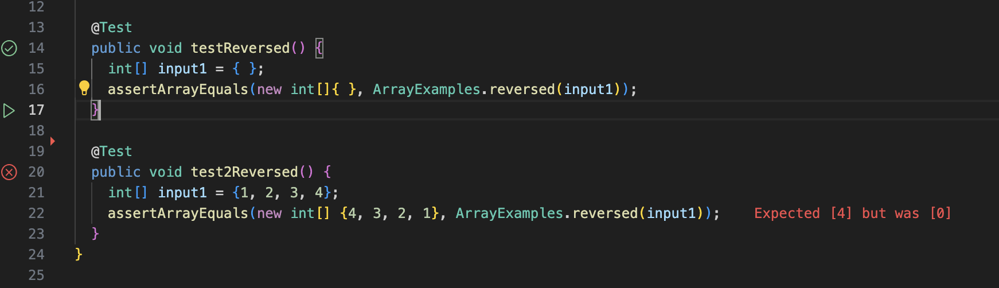

# Lab report 3
---

## Part 1 - Bugs
## Task

### Choose one of the bugs from week 4's lab.
### Provide:
  1. A failure-inducing input for the buggy program, as a **JUnit test** and any associated code 
  2. An input that *doesn't* induce a failure, as a JUnit test and any associated code
  3. The symptom, as the output of running the two tests above
  4. The bug, as the before-and-after code change requried to fix it
  5. Briefly describe why the fix addresses the issue

The bugged code that I will be working with:

```
// Returns a *new* array with all the elements of the input array in reversed
  // order
  static int[] reversed(int[] arr) {
    int[] newArray = new int[arr.length];
    for(int i = 0; i < arr.length; i += 1) {
      arr[i] = newArray[arr.length - i - 1];
    }
    return arr;
  }
```

A failure-inducing input for the buggy program:

```
@Test
  public void test2Reversed() {
    int[] input1 = {1, 2, 3, 4};
    assertArrayEquals(new int[] {4, 3, 2, 1}, ArrayExamples.reversed(input1));
  }
```

An input that doesn't induce a failure:

```
@Test
  public void testReversed() {
    int[] input1 = { };
    assertArrayEquals(new int[]{ }, ArrayExamples.reversed(input1));
  }
```

The symptom:


The code before the fix:
```
// Returns a *new* array with all the elements of the input array in reversed
  // order
  static int[] reversed(int[] arr) {
    int[] newArray = new int[arr.length];
    for(int i = 0; i < arr.length; i += 1) {
      arr[i] = newArray[arr.length - i - 1];
    }
    return arr;
  }
```

The code after the fix:
```
// Returns a *new* array with all the elements of the input array in reversed
  // order
  static int[] reversed(int[] arr) {
    int[] newArray = new int[arr.length];
    for(int i = 0; i < arr.length; i += 1) {
      newArray[i] = arr[arr.length - i - 1];
    }
    return newArray;
  }
```

This fix addresses the main issue with the code because in the original code, it assigns to the original array the values from `newArray`,
which the `newArray` doesn't have any values, so everything is replaced with 0s. In the fixed code, it assigns the empty, 
`newArray` with values from the original array, then returning that new array with the reversed values.

---

## Part 2 - Researching Commands
## Task:

Consider the commands `less`, `find`, and `grep`. Choose *one* of them. Online, find 4 interesting command-line options or alternate ways to use **the single command you chose**.

For each of those options, give 2 examples of using it on files and directories from `./technical`. That makes 8 total exmaples, all focused on a single command.
Show **each example** as a code block that shows the command and its output, and write a sentence or two about what it's doing and why it's useful

Along with each option/mode you show, **cite your source** for how you found out about it as a URL or description of where you found it. 

My command: `grep`

**First command-line option**: `grep -r`; searches a directory patch recursively instead of one or more listed files. 
Useful for trying to find specific key words throughout entire directories full of files.

**Source**: In class lecture, given on notes

Ex 1:
```
Josephs-MacBook-Air-3:docsearch josephtse$ grep -r "biomed" ./technical/biomed
./technical/biomed/1471-2202-2-9.txt:        http://www.biomedcentral.com/1471-2202/2/8). It is now
./technical/biomed/1472-6882-3-3.txt:        literature search in biomedicine depends on the appropriate
./technical/biomed/1472-6882-3-3.txt:        The controlled vocabulary for biomedicine has been
./technical/biomed/1472-6882-3-3.txt:        biomedical literature [ 3 ] . With the recent development
./technical/biomed/1472-6882-3-3.txt:        Other biomedical databases that include CAM literature,
./technical/biomed/1472-6882-3-3.txt:          biomedicine and it has a subset focusing on complementary
./technical/biomed/1472-6882-3-3.txt:          biomedicine, investigators and authors in the fields of
./technical/biomed/1471-2202-2-8.txt:          paper http://www.biomedcentral.com/1471-2202/2/9), and
./technical/biomed/1472-6947-3-8.txt:          Creators of biomedical databases use terminologies to
./technical/biomed/1472-6947-3-8.txt:        biomedical data sets. Public comment is welcomed.
./technical/biomed/gb-2001-2-4-research0012.txt:        biomedicine of the visual computer language paradigm [ 24,
./technical/biomed/gb-2001-2-4-research0012.txt:        to biomedical education, investigation and industry. For
./technical/biomed/gb-2003-4-7-r46.txt:        gene annotations or concepts from the biomedical
./technical/biomed/1471-2474-2-3.txt:        http://www.biomedcentral.com/1471-8219/2/5
./technical/biomed/1475-9276-1-3.txt:        33 34 ] . This model has been widely applied in biomedical
./technical/biomed/1472-6807-1-1.txt:        types of ligands could therefore have important biomedical
./technical/biomed/1472-6920-2-3.txt:        international journals [ 5 ] . For biomedical disciplines
./technical/biomed/1471-2105-3-17.txt:        study aimed at enabling the biomedical community to cope
./technical/biomed/1471-2105-3-16.txt:        The availability of biomedical literature in electronic
./technical/biomed/1477-7827-1-54.txt:        study increases the biomedical significance of findings
./technical/biomed/1471-2164-3-7.txt:        of biomedical research. These include, but are by no means
./technical/biomed/1471-2164-3-18.txt:          in Gel/Mount (biomeda) containing 4',6
./technical/biomed/1472-6882-1-12.txt:        biomedical framework. While the SR method has been used in
./technical/biomed/1472-6947-3-5.txt:        another level of biomedical data integration in which array
./technical/biomed/gb-2003-4-4-r28.txt:        biomedical research community. GoMiner is flexible both
```

Ex 2: (output shortened)
```
Josephs-MacBook-Air-3:docsearch josephtse$ grep -r "adult" ./technical/biomed
./technical/biomed/1471-2350-4-3.txt:            were adults (≥ 18 years of age) who identified
./technical/biomed/1471-2350-4-3.txt:            deficiency as an adult because he/she had frequent or
./technical/biomed/1471-2350-4-3.txt:            central Alabama [ 7 8 9 10 ] ; 2) in adults, serum
./technical/biomed/1471-2350-4-3.txt:            Caucasian adult subjects from Alabama who had undergone
./technical/biomed/1471-2350-4-3.txt:          population frequency of CVID and IgGSD in adults. At the
./technical/biomed/1471-2350-4-3.txt:          frequencies of these disorders in adults in central
./technical/biomed/1471-2350-4-3.txt:        in Caucasian adults diagnosed in routine medical care
./technical/biomed/1471-2350-4-3.txt:        phenotypic expression of CVID and IgGSD in adults. The
./technical/biomed/1471-2350-4-3.txt:        in adults in central Alabama is 0.0092. This estimated
./technical/biomed/1471-2156-2-3.txt:          obtained from all adult participating subjects and from
./technical/biomed/1471-2156-3-11.txt:        adult tissues, as well as in late fetal organs and
./technical/biomed/1471-2156-3-11.txt:        adult organs and structures, but that the expression in
./technical/biomed/1471-2156-3-11.txt:        from fetal and adult tissues derived from interspecific
./technical/biomed/1471-2156-3-11.txt:        Other fetal and adult tissues were also assessed in
./technical/biomed/1471-2156-3-11.txt:        and adult tissues, reflecting parental imprinting, as well
./technical/biomed/1471-2156-3-11.txt:        representation in cDNAs from various fetal and adult
./technical/biomed/1471-2156-3-11.txt:          was used to prepare total RNA from fetal and adult mouse
./technical/biomed/1471-2466-1-1.txt:        hospitalized HIV-infected adults. Knowledge of the types of
./technical/biomed/1471-2466-1-1.txt:        consecutive hospital admissions of 599 adults with HIV
./technical/biomed/1471-2466-1-1.txt:        599 adult patients with HIV infection. The study population
./technical/biomed/1471-2466-1-1.txt:        study of 133 HIV-infected adults with pulmonary MTB showed
./technical/biomed/1471-2202-2-9.txt:        adult neurons [ 31, 32]. Recent
./technical/biomed/1471-2202-2-9.txt:          seen on white matter in sections of adult 
./technical/biomed/1471-2202-2-9.txt:          ng/ml) for 21 hours prior to plating on sections of adult
./technical/biomed/1471-2202-2-9.txt:          of adult forebrain in the presence of dibutyryl-cAMP
./technical/biomed/1471-2202-2-9.txt:          parallel than those on adult
```

---

**Second command-line option**: `grep -c`; counts the amount of times the string pops up. Can be useful to keep track of word count of a specific word

**Source**: In class lecture, given by Prof. Solares

Ex 1:
```
Josephs-MacBook-Air-3:docsearch josephtse$ grep -c "adult" ./technical/biomed/1468-6708-3-1.txt
20
```

Ex 2:
```
Josephs-MacBook-Air-3:docsearch josephtse$ grep -c "BMI" ./technical/biomed/1468-6708-3-1.txt
32
```

---

**Third command-line option**: `grep -i`; makes the search case insensitive. Can be useful if you want to count all words regardless of capitalization

**Source**: `man grep` command in VSCode

Ex 1:
```
Josephs-MacBook-Air-3:docsearch josephtse$ grep -i "bmi" ./technical/biomed/1468-6708-3-1.txt
        between body mass index (BMI) and mortality, controlling
        excess risk for persons with very low BMI, but that persons
        with moderately high BMI had little or no extra risk except
        because few studies have examined the relation of BMI to
        events [ 10 ] . In this paper we study whether BMI at
          BMI was calculated as measured weight in kilograms
          BMI of 18.5 to 24.9; overweight as 25 to 29.9; and
          separately the group with BMI between 18.5 and 20, which
          with BMI. To adjust for possible confounding we chose
          and likely to be related to BMI. Self-reported covariates
          plotted mean adjusted YOL and YHL against BMI, and tested
          for difference among BMI groups using confidence
          the effect size for each measure, comparing each BMI
        smokers. Black women had a higher mean BMI and higher
        percent obese (BMI ≥ 30) than the other three groups. Black
        statistically significant (p <.05) except for BMI and
        significant differences between black and white for BMI,
        the difference in BMI was no longer statistically
        significantly on BMI, BMI>30, weight loss since age 50,
        We next examined the relationship of BMI to YOL and YHL.
        BMI below 18.5, but averaged 6.6 years for women with a BMI
        only discrepancy is for men with BMI < 18.5, a category
        with BMI from 18.5 to 20 would be considered 'normal' by
        increase sample size for those with low BMI, we combined
        the two lower categories, defining underweight as a BMI
        BMI. For each BMI category the mean and its 95% confidence
        between BMI and YOL for BMI above 20. Underweight women
        normal group. The relationship of BMI to YHL for men is
        similar, but differences among BMI groups were not
        to the normal BMI group. The effect sizes are shown in
          et al proposed a desirable BMI of
        BMI Body mass index
```

Ex 2: (using count as well to show that it is case insensitive compared option 2, ex 2)
```
Josephs-MacBook-Air-3:docsearch josephtse$ grep -c -i "bmi" ./technical/biomed/1468-6708-3-1.txt
32
```

---

**Fourth command-line option**: `grep -n` outputs the line number at which the string is found at.
This can be useful if you want to know quickly specifically where a string is located for faster searching, assuming you know what you want to find.

**Source**: `man grep` command in VSCode

Ex 1:
```
Josephs-MacBook-Air-3:docsearch josephtse$ grep -n "Materials and methods" ./technical/biomed/1468-6708-3-1.txt
45:        Materials and methods
```

Ex 2:
```
Josephs-MacBook-Air-3:docsearch josephtse$ grep -n "CHS" ./technical/biomed/1468-6708-3-1.txt
49:          The Cardiovascular Health Study (CHS) is a
366:          CHS participants were somewhat healthier than the
424:        CHS Cardiovascular Health Study
```


